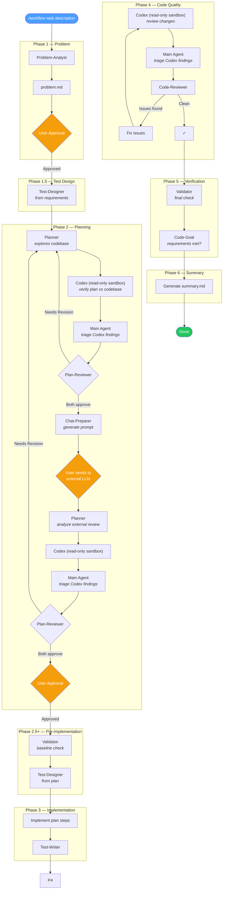

# Claude Code Setup

Custom agents and skills for Claude Code.

## Workflow Diagram

## Agents

| Agent | Model | Purpose |
|-------|-------|---------|
| Chat-Preparer | sonnet | Prepare context and prompts for external LLM chat (Claude.ai, ChatGPT) |
| Code-Goal | sonnet | Verify that implementation solves the original problem |
| Code-Reviewer | opus | Find bugs, vulnerabilities, performance issues, over-engineering, and style violations in code |
| Codex | gpt-5.3-codex | Verify plans/code against codebase in read-only sandbox |
| Log-Analyzer | sonnet | Analyze logs to detect anomalies, errors, and investigate specific problems |
| Plan-Reviewer | opus | Review implementation plans from an architecture standpoint |
| Planner | opus | Create or revise implementation plans from problem statements and codebase context |
| Problem-Analyst | sonnet | Explore codebase to understand current state and formulate a clear problem statement |
| Test-Designer | opus | Design test cases from requirements and implementation plans |
| Test-Writer | sonnet | Write tests for implemented features, following existing test patterns in the codebase |
| Validator | sonnet | Run tests, linters, type checks, and other validation commands |
| Web-Researcher | sonnet | Search the web for documentation, APIs, SDKs, and technical references |

## Skills

| Skill | Description |
|-------|-------------|
| `/analyze-logs` | Analyze logs for anomalies or investigate a specific problem |
| `/gather-context` | Gather codebase context by finding relevant files for a task |
| `/plan` | Create an implementation plan using the Planner subagent (opus model) |
| `/prepare-chat` | Prepare context and prompt files for external chat (Claude.ai, ChatGPT) to generate or review a plan |
| `/review-code` | Review code for bugs, vulnerabilities, and performance issues using Codex + Code-Reviewer subagent (opus model) |
| `/review-plan` | Review an implementation plan using the Plan-Reviewer subagent (opus model) |
| `/sync-global` | Sync global ~/.claude agents and commands into this repo (global is source of truth) |
| `/verify` | Verify that implementation solves the original problem using the Code-Goal subagent |
| `/web-research` | Search web for docs/APIs/SDKs and save as reference |
| `/workflow` | Run the full structured workflow for a task (problem clarification, planning, implementation, review, verification) |
