# Claude Code Setup

Custom agents and skills for Claude Code.

## Workflow Diagram

```mermaid
flowchart TD
    START(["/workflow task description"]) --> P1

    subgraph "Phase 1 — Problem"
        P1[Problem-Analyst] --> problem.md
        problem.md --> USER1{User Approval}
    end

    USER1 -->|Approved| P15

    subgraph "Phase 1.5 — Test Design"
        P15[Test-Designer<br><i>from requirements</i>]
    end

    P15 --> P2

    subgraph "Phase 2 — Context"
        P2[Explore Agent<br><i>find relevant files</i>] --> P25[Context-Loader<br><i>trim & extract</i>]
    end

    P25 --> P3

    subgraph "Phase 3 — Planning"
        P3[Planner] --> P3R{Plan-Reviewer}
        P3R -->|Needs Revision| P3
        P3R -->|Approved| EXT

        EXT[Chat-Preparer<br><i>generate prompt</i>] --> USER2{User sends to<br>external LLM}
        USER2 --> ANAL[Planner<br><i>analyze external review</i>]
        ANAL --> P3R2{Plan-Reviewer}
        P3R2 -->|Needs Revision| P3
        P3R2 -->|Approved| USER3{User Approval}
    end

    USER3 -->|Approved| P35

    subgraph "Phase 3.5+ — Pre-Implementation"
        P35[Validator<br><i>baseline check</i>] --> P37[Test-Designer<br><i>from plan</i>]
    end

    P37 --> P4

    subgraph "Phase 4 — Implementation"
        P4[Implement plan steps] --> TESTS[Test-Writer]
    end

    TESTS --> P5

    subgraph "Phase 5 — Code Quality"
        P5[Code-Reviewer] -->|Issues found| FIX[Fix issues] --> P5
        P5 -->|Clean| DONE5[✓]
    end

    DONE5 --> P6

    subgraph "Phase 6 — Verification"
        P6[Validator<br><i>final check</i>] --> P6G[Code-Goal<br><i>requirements met?</i>]
    end

    P6G --> P7

    subgraph "Phase 7 — Summary"
        P7[Generate summary.md]
    end

    P7 --> END([Done])

    style START fill:#4a9eff,color:#fff
    style END fill:#22c55e,color:#fff
    style USER1 fill:#f59e0b,color:#fff
    style USER2 fill:#f59e0b,color:#fff
    style USER3 fill:#f59e0b,color:#fff
```

## Agents

| Agent | Model | Purpose |
|-------|-------|---------|
| Problem-Analyst | sonnet | Clarify problem, define acceptance criteria |
| Test-Designer | opus | Design test cases from requirements and plan |
| Context-Loader | sonnet | Read files, trim to relevant content |
| Planner | opus | Create and revise implementation plans |
| Plan-Reviewer | opus | Review plans for gaps and issues |
| Chat-Preparer | sonnet | Prepare prompts for external LLM review |
| Validator | sonnet | Run tests, linters, type checks |
| Test-Writer | sonnet | Write tests following project conventions |
| Code-Reviewer | opus | Find bugs, vulnerabilities, perf issues |
| Code-Goal | sonnet | Verify implementation matches requirements |
| Code-Simplifier | opus | Find unnecessary complexity |
| E2E-Tester | sonnet | Run e2e API tests against running services |
| Web-Researcher | sonnet | Search web for docs/APIs/references |
| Log-Analyzer | sonnet | Analyze logs for anomalies |

## Skills

| Skill | Description |
|-------|-------------|
| `/workflow` | Full structured workflow (diagram above) |
| `/plan` | Create implementation plan only |
| `/review-plan` | Review an existing plan |
| `/review-code` | Review code for bugs and vulnerabilities |
| `/simplify` | Find code simplification opportunities |
| `/verify` | Verify implementation matches requirements |
| `/gather-context` | Find relevant files for a task |
| `/prepare-chat` | Prepare prompt for external LLM |
| `/analyze-logs` | Analyze logs for anomalies |
| `/web-research` | Search web for documentation |
